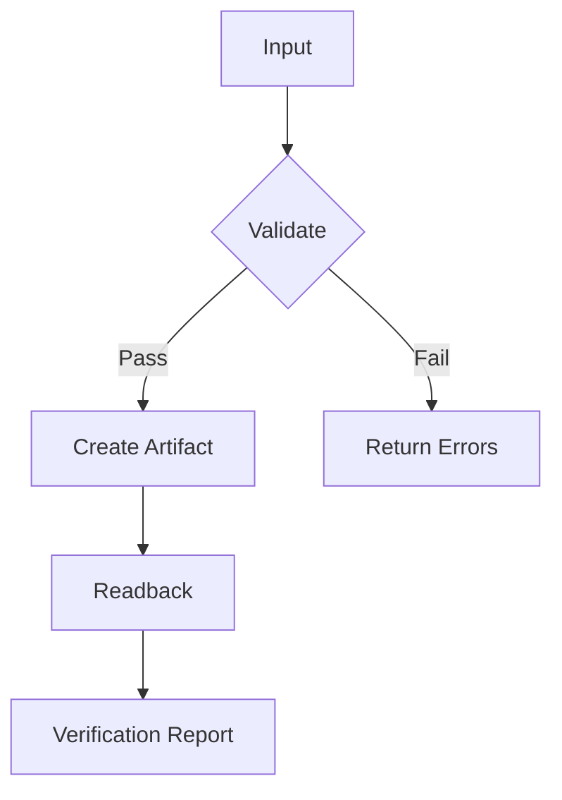

# Feishu Content Studio

Build and validate Feishu content deliverables in a reliable sequence.

## Execute workflow

1. Check Feishu capability first.
   - Run `feishu_app_scopes`.
   - If scope is insufficient, stop and report missing permissions.
2. Normalize user input into a job spec.
   - Required: title, content blocks, target artifact type, validation strictness.
   - Optional: target folder/wiki node, language, template style.
3. Create artifact by type.
   - Doc: use `feishu_doc.create`, then `write/append/insert_after/update_block` as needed.
   - Sheet: use `feishu_drive` to create/list/manage a sheet file object; if cell-level API is unavailable, document limitation.
   - PPT: use `feishu_slides.create`, then fill deck outline in companion doc when slide-body API is unavailable.
   - Mindnote/Flowchart: prefer structured markdown in doc; optionally create `mindnote` object via drive when available.
4. Read back and validate.
   - Doc: `feishu_doc.read` and/or `list_blocks`.
   - File objects: `feishu_drive.info` and title/type checks.
   - Compare requested sections vs actual sections.
5. Emit verification report.
   - Include: artifact ids/links, write status, gaps, retries, next actions.

## Validation rules

- Validate required fields before API calls.
- Reject empty titles/content unless user explicitly requests placeholders.
- Enforce idempotent mode for repeated runs by checking existing artifact name in target folder when requested.
- After write, perform readback diff at heading/list level.
- Record partial success clearly (e.g., PPT file created but no fine-grained slide edit API).

## Artifact recipes

### 1) Document (docx)

- Create doc with clear title.
- Write sections:
  - Overview
  - Requirements
  - Output
  - Verification
- Use block operations for targeted updates.

### 2) Sheet

- Create a sheet-type file object.
- If cell API absent in toolset, generate a companion doc containing the tabular data in markdown and mention limitation.

### 3) PPT

- Create slide deck.
- If slide edit API unavailable, produce a companion doc with slide-by-slide content script.

### 4) Mind map

- Produce hierarchical markdown (`#`, `##`, `-`) in doc.
- Optionally create mindnote file object when supported.

### 5) Flowchart

- Generate Mermaid flowchart block in doc:

## Use bundled scripts

- Run `scripts/validate_payload.py` before execution for schema checks.
- Run `scripts/verify_report.py <report.json>` to validate post-run report completeness.

## References

- Detailed payload and report schemas: `references/schemas.md`
- Execution checklist and fallback matrix: `references/fallbacks.md`
